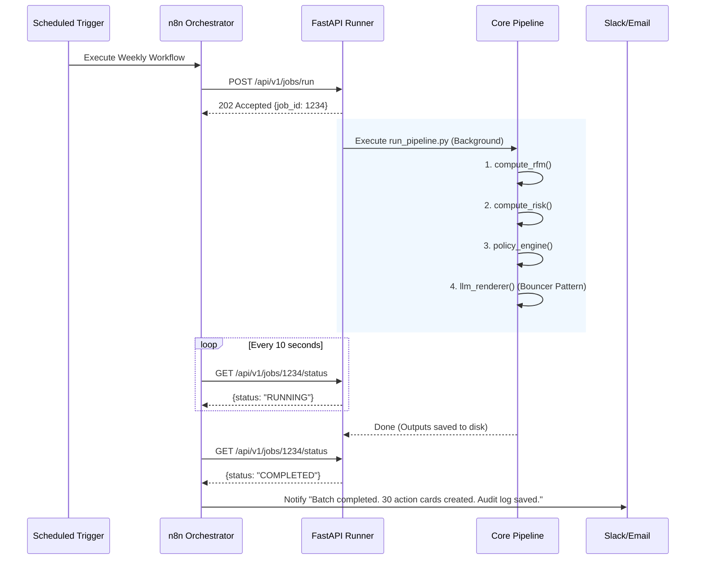

# CPG Decision Engine Runner API & n8n Workflow

**Goal:** Wrap the existing deterministic, offline CPG Decision Engine (RFM -> Risk -> Policy -> Bouncer LLM) into a unified executable and expose it via a FastAPI job runner. An external n8n workflow will trigger this runner, mimicking a modern orchestration architecture without violating the strict offline constraint of MVP v0.

---

## 1. System Components & Responsibilities

### 1.1 Existing Core Pipeline (Reused)
All business logic remains untouched to guarantee the "Brain-Mouth Decoupling" and determinism.
- `compute_rfm.py`: Canonical ingestion and segmentation.
- `compute_risk.py`: Empirical replenishment cycles and overdue risk.
- `policy_engine.py`: Action generation and frequency capping.
- `llm_explainability_renderer.py` & `llm_safety_gateway.py`: The Bouncer pattern validator and renderer.

### 1.2 The Unified Entrypoint (`run_pipeline.py`)
- **Responsibility:** A single Python script that executes the 4 core steps sequentially.
- **Why:** Instead of invoking 4 separate bash commands, the API needs one clean Python function to call, which centralizes error handling and logs execution time.

### 1.3 The FastAPI Runner (`runner_api/main.py`)
- **Responsibility:** Provides an HTTP interface for external orchestrators.
- **Endpoints:**
  - `POST /api/v1/jobs/run`: Spawns a background thread/process to execute `run_pipeline.py`. Returns a `job_id`.
  - `GET /api/v1/jobs/{job_id}/status`: Returns the current state of the job (`RUNNING`, `COMPLETED`, `FAILED`).
  - `GET /api/v1/jobs/{job_id}/results`: Optional endpoint to fetch the generated `final_action_cards_with_copy.jsonl` or `telemetry_audit.jsonl` summary upon completion.

### 1.4 Docker & Docker Compose (`Dockerfile`, `docker-compose.yml`)
- **Responsibility:** Containerizes the CPG Decision Engine alongside its FastAPI runner, ensuring reproducible environments and easy deployment next to the n8n container.

### 1.5 n8n Workflow Spec (`n8n_workflow_spec.json`)
- **Responsibility:** The external orchestrator. The workflow will:
  1. Trigger on a schedule (e.g., Weekly "Campaign Monday").
  2. Send a `POST` to the Runner API to start the batch calculation.
  3. Enter a Wait/Polling loop checking the `GET` status endpoint.
  4. Upon success, optionally fetch the audit metrics or notify a Slack channel that the `final_action_cards_with_copy.jsonl` is ready for review.

---

## 2. Data Flow & Orchestration (Plan B)

---

## 3. Exit Criteria for Plan B (MVP v0)

1. **`run_pipeline.py`** successfully triggers the full pipeline end-to-end via Python imports or `subprocess`.
2. **`runner_api`** stands up successfully via `uvicorn` and accepts requests.
3. **Docker stack** seamlessly boots both the Runner and guarantees paths map to the internal models.
4. **n8n JSON spec** is structurally valid and imports cleanly into an n8n dashboard.
