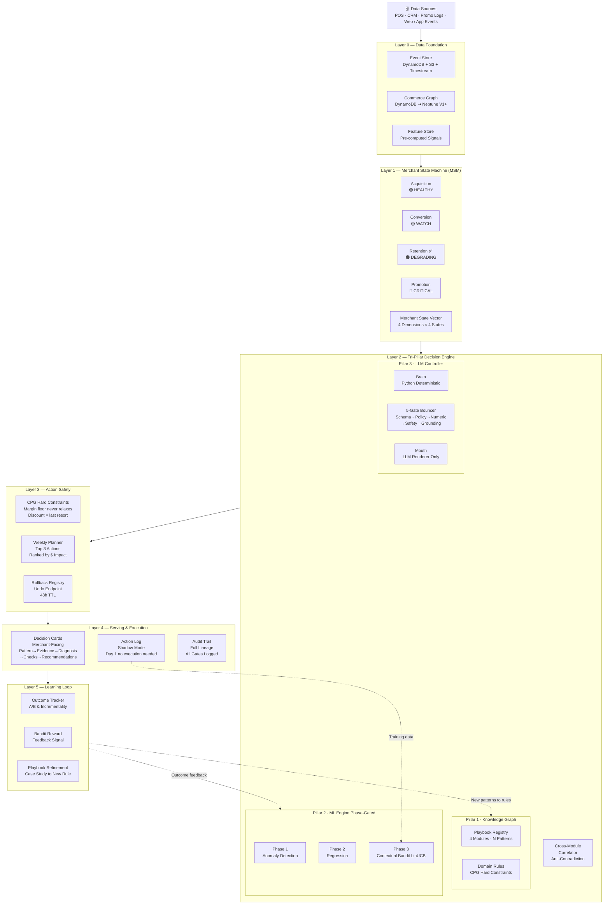
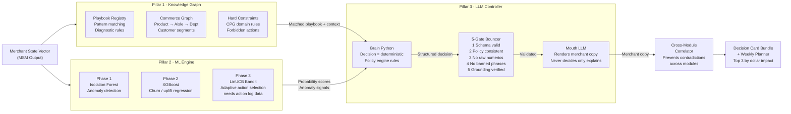
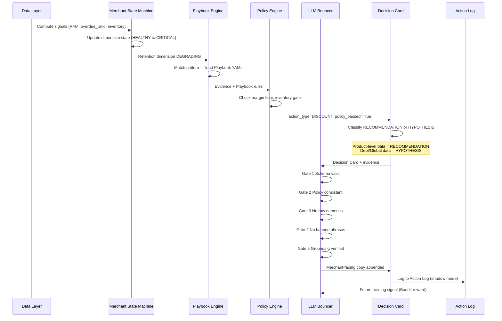
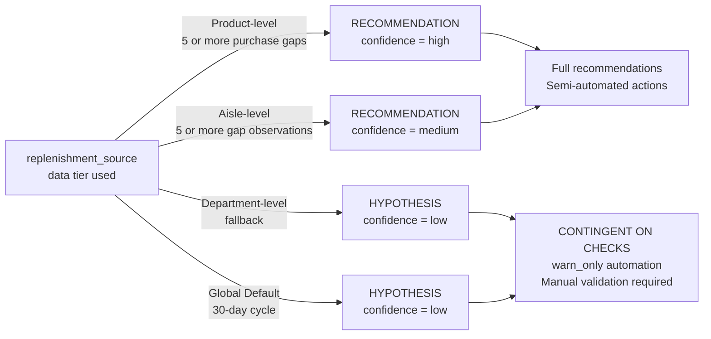
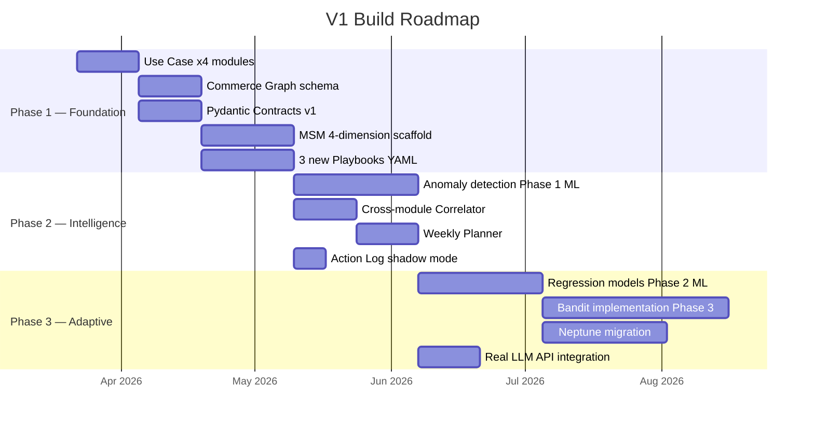

# CPG Decision Engine — V1 Architecture Blueprint

> **Purpose:** Partner review & discussion document
> **Status:** Design phase — open for feedback
> **Date:** 2026-03-22

---

## 1. What We're Building

An **Operating Intelligence Layer** for CPG brands — not a dashboard, not a chatbot.

The system takes raw commerce data, identifies at-risk business patterns across 4 modules, and produces **merchant-facing Decision Cards** with specific, diagnostic, prioritized recommendations tied to business outcomes.

**Core positioning:**
- Codified expertise engine (playbooks as competitive moat)
- Deterministic decisions, LLM for explanation only
- Every recommendation is auditable, reversible, and margin-safe

---

## 2. System Architecture — 5 Layers

---

## 3. Tri-Pillar Decision Engine — Zoom In

---

## 4. Single Decision Card — Generation Flow

---

## 5. Module Coverage

| Module | Status | Patterns | Actions |
|--------|--------|----------|---------|
| **Retention / Replenishment** | ✅ V0 Implemented | Overdue ratio, purchase gap | DISCOUNT, REMINDER, SUPPRESS |
| **Acquisition Efficiency** | ⬜ Designed | CAC anomaly, channel attribution | REALLOCATE_BUDGET, PAUSE_CHANNEL |
| **Conversion / Merchandising** | ⬜ Designed | Cart abandon, PDP drop-off | REORDER_SHELF, BUNDLE_SUGGEST |
| **Promotion / Offer Strategy** | ⬜ Designed | Discount dependency, margin erosion | ROTATE_OFFER, HOLD_DISCOUNT |

---

## 6. RECOMMENDATION vs HYPOTHESIS Classification

---

## 7. CPG Hard Constraints (Non-Negotiable)

Encoded in Playbook YAML — cannot be overridden by LLM or ML outputs.

| Constraint | Rule | Reason |
|---|---|---|
| **Margin Floor** | Never discount below gross margin threshold | Direct P&L protection |
| **Discount = Last Resort** | Offer REMINDER before DISCOUNT | Protect brand equity |
| **Incrementality Required** | No discount without uplift attribution | Avoid subsidizing organic buyers |
| **Cold Prospect Gate** | No discount offer to first-time visitors | Acquisition ≠ Retention lever |
| **Attribution Window** | Retention 7d / Acquisition 30d / Promotion 14d | Different modules measure differently |
| **Rollback TTL** | Every write action has undo endpoint, 48h window | Operator trust |

---

## 8. V0 → V1 Asset Mapping

All V0 components are preserved and extended, not replaced.

| V0 Component | V1 Position | Upgrade Needed |
|---|---|---|
| `compute_rfm.py` | Layer 0: Feature Store | Add streaming variant |
| `compute_risk.py` | Layer 1: MSM (Retention dim) | Extend to 4 dimensions |
| `policy_engine.py` | Layer 3: Action Safety | Add cross-module check |
| `decision_card_builder.py` | Layer 2: LLM Controller output | Add module field |
| `playbook_engine/` | Layer 2: KG Playbook Registry | Add 3 more modules |
| `llm_safety_gateway.py` | Layer 2: 5-Gate Bouncer | Already in place |
| `recommendation_scorer.py` | Layer 3: Quality scoring | Add $ impact proxy |
| `telemetry_audit_logger.py` | Layer 4: Audit Trail | Already patchable |
| `run_pipeline.py` | Layer 4: Serving orchestrator | Add MSM orchestration |

---

## 9. Phase Roadmap

---

## 10. What We Borrowed & What We Added

### Borrowed from Partner's Tri-Pillar Design
- **Three-pillar separation**: KG / ML / LLM as distinct, coordinated pillars rather than monolithic AI
- **Knowledge Graph as world model**: shared domain reality, not just a lookup table
- **ML as probabilistic engine**: separate from rule-based logic, contributing probability scores

### Original Innovations in This Design
- **Brain-Mouth Decoupling**: Python makes all decisions, LLM only renders explanation — eliminates LLM slop
- **RECOMMENDATION vs HYPOTHESIS** classification driven by data completeness tier
- **5-Gate Bouncer**: structured validation before any LLM output reaches merchant
- **Merchant State Machine 4D × 4 States**: merchant-level view, not customer×product granularity
- **Cross-Module Correlator**: prevents contradictory actions across the 4 modules
- **Action Log shadow mode from Day 1**: accumulates training data before execution is live
- **Rollback Registry**: every write action has an undo endpoint — trust infrastructure
- **Phase-gated ML**: Bandit stays dormant until action log provides sufficient data — no cold-start failure
- **CPG Hard Constraints in Playbook YAML**: domain expertise as code, not embedded in prompts

---

## 11. Open Questions for Discussion

1. **Commerce Graph granularity** — Start with `Product → Aisle → Dept` (existing) or add `Brand → Merchant` relationship from Day 1?

2. **MSM trigger thresholds** — What signal combination flips a dimension from WATCH → DEGRADING? Needs data inventory to answer.

3. **Action Log graduation criteria** — Shadow mode ends when? What volume of logged actions is enough before execution goes live?

4. **Weekly Planner ranking** — Rank by expected revenue impact proxy, or confidence × impact composite? How to handle uncertainty in ranking?

5. **Cross-module conflict resolution** — If Retention says DISCOUNT and Promotion says HOLD_DISCOUNT for the same product, who wins? Is priority order fixed or context-dependent?

6. **LLM provider** — Anthropic Claude API (current architecture assumption) or should the 5-Gate Bouncer be provider-agnostic?

7. **Merchant UX rendering** — Decision Cards are JSONL today. What is the target surface? Dashboard widget, email digest, or API endpoint for partner's frontend?

---

*V0 codebase is fully operational and all components map directly into this architecture.*
*This document describes the V1 target state — V0 is the foundation, not replaced.*
